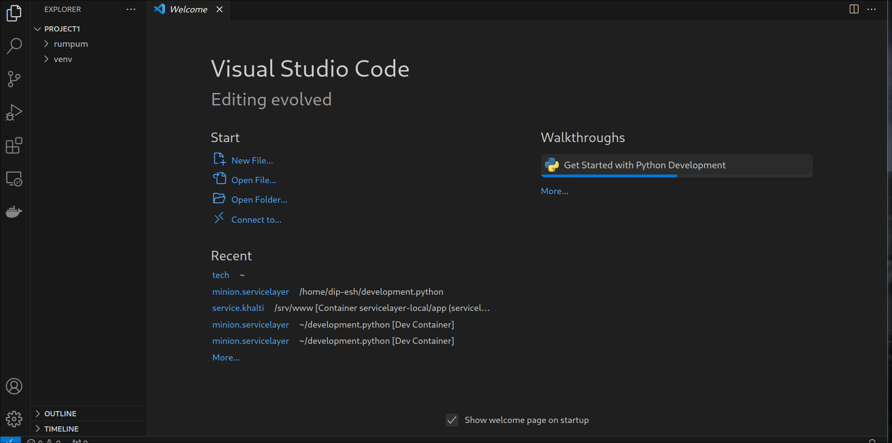
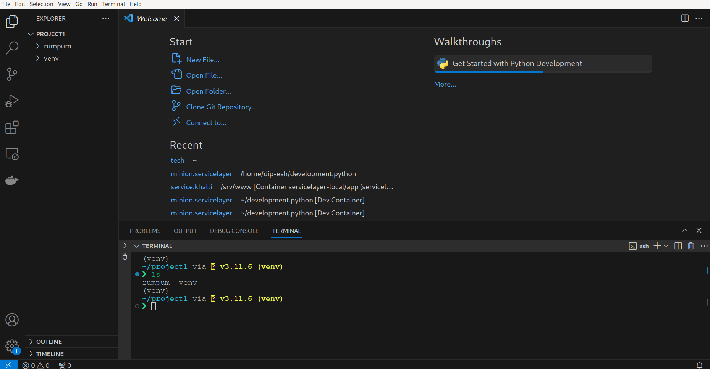
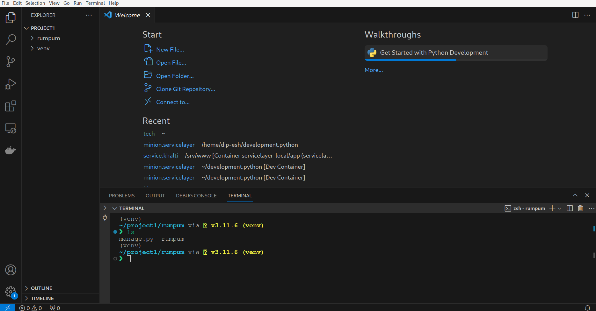
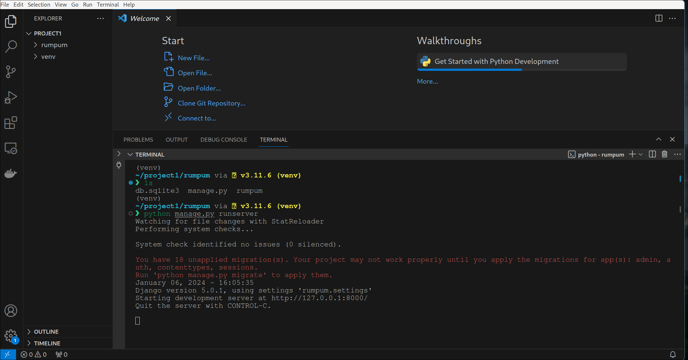
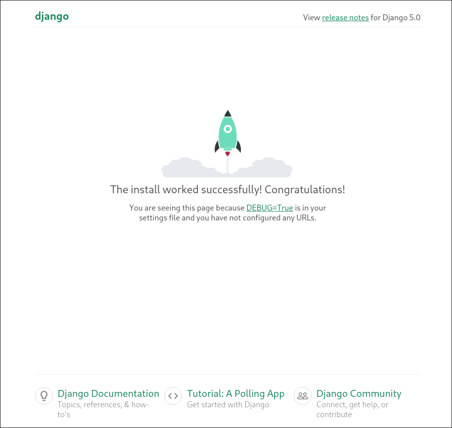
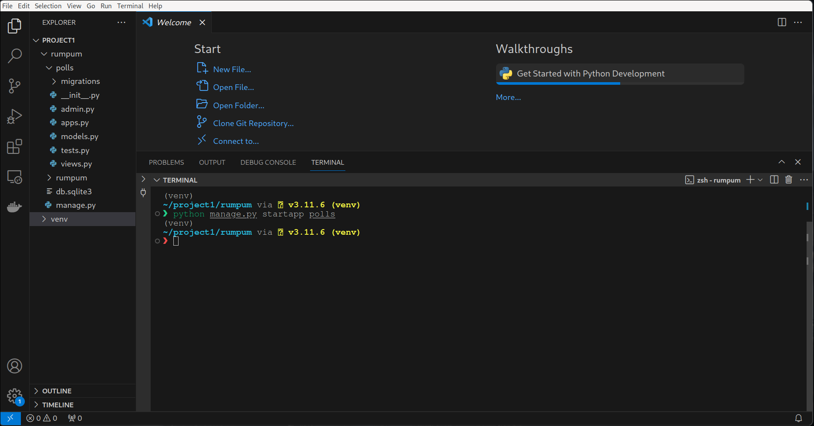

# Django Begginer

Base Level Description on starting django project from scratch.

- Python and Pip Installation are required.
- Other depedency is: virtualenv: Install it with pip install virtualenv


## Starting

- Create a new empty folder in the situable folder of your choice. Suppose its project1 inside Desktop
- Now open that folder in cmd/powershell/terminal to create the virtualenv

## Cretae virtual environemnt
- Create the virtual environment with the command virtualenv name-of-virtualenv, lets say its name is venv
```sh
virtualenv venv
```
- Now our empty folder project1 will have another folder inside it with the name venv

## Activating virtual environment
- On Linux or Mac:
-- use the command name-of-virtualev/bin/activate, our case source venv/bin/activate
```sh
source venv/bin/activate
```
- On Windows:
-- use the command .\env_name\Scripts\activate, our case .\venv\Scripts\activate
```sh
.\venv\Scripts\activate
```
-- for windows we may need to use Activate.ps1 or Activate.bat

# Django Project Structure.
- Now our virtual environemnt is activated, lets install django with pip install django.
```sh
pip install django
```

# Create DJango Project
- To create django project use the command django-admin startproject name-of-django-project, lets say its rumpum for our case.
```sh
django-admin startproject rumpum
```
- Now we will have a another folder beside our venv  folder with the name rumpum.

# Till Now
- We have a folder project1 inside Desktop and inside that project1 we have 2 folder with name rumpum and venv.

# Test/Code
- Open the folder in VScode, make sure to open the project1 only, and now our vscode will have folder listed like

- Now In VS Code, open the Command Palette (View > Command Palette or (Ctrl+Shift+P)).
  Then select the Python: Select Interpreter command: 
  The command presents a list of available interpreters that VS Code can locate automatically
  
  From the list, select the virtual environment in your project folder that starts with ./.venv or .\.venv
  
- If the Terminal doesnot automatically opens with the virtualenvironamnet activated, what you can do is 
  Press Ctrl+Shift+` which creates a terminal and automatically activates the virtual environment by running its activation script.
- Note: On Windows, if your default terminal type is PowerShell, you may see an error that it cannot run activate.ps1 because
  running scripts is disabled on the system. The error provides a link for information on how to allow scripts. Otherwise,
  use Terminal: Select Default Profile to set "Command Prompt" or "Git Bash" as your default instead.
- Now if you do ls or dir or dirs, you will see 2 folder, rumpum and venv.

- To run django project, change directory to rumpum(our django project name) with the command cd rumpum and press Enter.
```sh
cd rumpum
```
- Now if you do ls or or dir or dirs you will bunch of file, among them one will be manage.py.
  
- Now run the django application with command python manage.py runserver and press enter, after that open a browser and type in the url 
```sh
python manage.py runserver
```
  
  127.0.0.1:8000 and you will see django is running succesfully.
  

## Django App
- In django we have apps and projects, lets proceed to create a app call polls.
- To do so, stop the running django process in your vscode terminal by pressing Ctrl + C
- And use the command python manage.py startapp app-name, app-name will be polls in our case.
```sh
python manage.py startapp polls
```
- After that, in our vscode, we will have another folder called polls inside our rumpum directory.
- Our overall folder structure in vscode will look something like this.
  


# things to remember
- activate virtual environamnet before running the django application.
- working directory, this is the folder where manage.py file will be.

# command to remember
- python manage.py runserver
